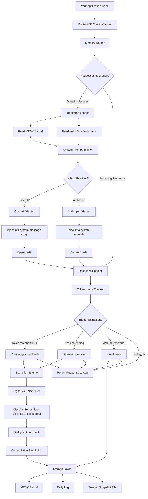

# ContextMD

A provider-agnostic middleware that gives OpenAI, Anthropic, and LiteLLM API calls persistent, human-readable memory using local Markdown files.

**ContextMD** is a middleware library that adds **persistent memory** to LLM API calls (OpenAI, Anthropic, LiteLLM).

## Core Problem It Solves
LLM APIs are stateless — each request starts fresh with no memory of past conversations. ContextMD fixes this by:

1. **Automatically injecting stored memory** into every API request
2. **Extracting memorable facts** from responses and saving them
3. **Storing everything in human-readable Markdown files** (not a database)

## Key Features

- **Provider-agnostic** — Works with OpenAI, Anthropic, and 100+ providers via LiteLLM
- **Three memory types**:
  - **Semantic** — Permanent facts (user preferences, project context)
  - **Episodic** — Time-stamped events (decisions made, tasks completed)
  - **Procedural** — Learned workflows ("always use pnpm")
- **Human-readable storage** — All memory stored as `.md` files you can read/edit
- **Session management** — Group related conversations with snapshots
- **CLI tools** — `contextmd show`, `contextmd add`, `contextmd history`, etc.

## Use Case Example
An AI coding assistant that remembers:
- Your tech stack preferences
- Past decisions you made
- Your coding style rules

...across multiple conversations, without you repeating yourself.

## Installation

```bash
pip install contextmd

# With provider support
pip install contextmd[openai]      # OpenAI only
pip install contextmd[anthropic]   # Anthropic only
pip install contextmd[litellm]     # LiteLLM (100+ providers)
pip install contextmd[all]         # All providers
```

## Quick Start

### OpenAI

```python
from openai import OpenAI
from contextmd import ContextMD

# Wrap your existing client
client = ContextMD(OpenAI(), memory_dir=".contextmd/")

# Use exactly like normal - memory is automatic
response = client.chat.completions.create(
    model="gpt-5.2",
    messages=[{"role": "user", "content": "Hello!"}]
)
```

### Anthropic

```python
from anthropic import Anthropic
from contextmd import ContextMD

client = ContextMD(Anthropic(), memory_dir=".contextmd/")

response = client.messages.create(
    model="claude-opus-4-6",
    max_tokens=1024,
    messages=[{"role": "user", "content": "Hello!"}]
)
```

### LiteLLM (100+ providers)

```python
import litellm
from contextmd import ContextMD

client = ContextMD(litellm, memory_dir=".contextmd/")

# Works with any LiteLLM-supported model
response = client.completion(
    model="gpt-5.2",
    messages=[{"role": "user", "content": "Hello!"}]
)

# Or use Claude, Gemini, etc.
response = client.completion(
    model="claude-opus-4-6",
    messages=[{"role": "user", "content": "Hello!"}]
)
```

## How It Works

ContextMD intercepts your API calls and:

1. **Bootstrap Loading**: Injects stored memory into every request
2. **Response Processing**: Tracks token usage and extracts memorable facts
3. **Memory Storage**: Saves facts to human-readable Markdown files

### Memory Types

- **Semantic**: Permanent facts (preferences, tech stack, project context)
- **Episodic**: Time-stamped events (decisions, tasks completed)
- **Procedural**: Learned workflows ("Always use pnpm")

### File Structure

```
.contextmd/
├── MEMORY.md              # Semantic facts (200 line cap)
├── config.md              # Configuration
├── memory/
│   ├── 2025-03-01.md      # Daily episodic logs
│   └── 2025-03-02.md
└── sessions/
    └── 2025-03-01-auth.md # Session snapshots
```

## API Reference

### Manual Memory

```python
# Remember something explicitly
client.remember("User prefers dark mode", memory_type="semantic")
client.remember("Completed auth feature", memory_type="episodic")
client.remember("Always run tests before commit", memory_type="procedural")
```

### Session Management

```python
# Create a named session
with client.new_session("auth-implementation") as session:
    response = client.chat.completions.create(...)
    # Session snapshot saved automatically on exit

# Or manually
session = client.new_session("feature-work")
# ... do work ...
session.end()  # Saves snapshot
```

### Configuration

```python
from contextmd import ContextMD, ContextMDConfig

config = ContextMDConfig(
    memory_line_cap=200,           # Max lines in MEMORY.md
    bootstrap_window_hours=48,     # Hours of episodic memory to load
    compaction_threshold=0.8,      # Token threshold for extraction
    snapshot_message_count=15,     # Messages in session snapshots
    extraction_frequency="session_end",  # When to extract
)

client = ContextMD(openai_client, config=config)
```

## CLI

```bash
# Initialize in current directory
contextmd init

# View memory
contextmd show

# View recent activity
contextmd history --hours 24

# List sessions
contextmd sessions

# Add memory manually
contextmd add "User prefers TypeScript" --type semantic

# View statistics
contextmd stats

# Reset all memory
contextmd reset
```

## Architecture



## Development

```bash
# Install with dev dependencies
pip install -e ".[dev]"

# Run tests
pytest

# Type checking
mypy src/contextmd

# Linting
ruff check src/contextmd
```

## License

MIT
